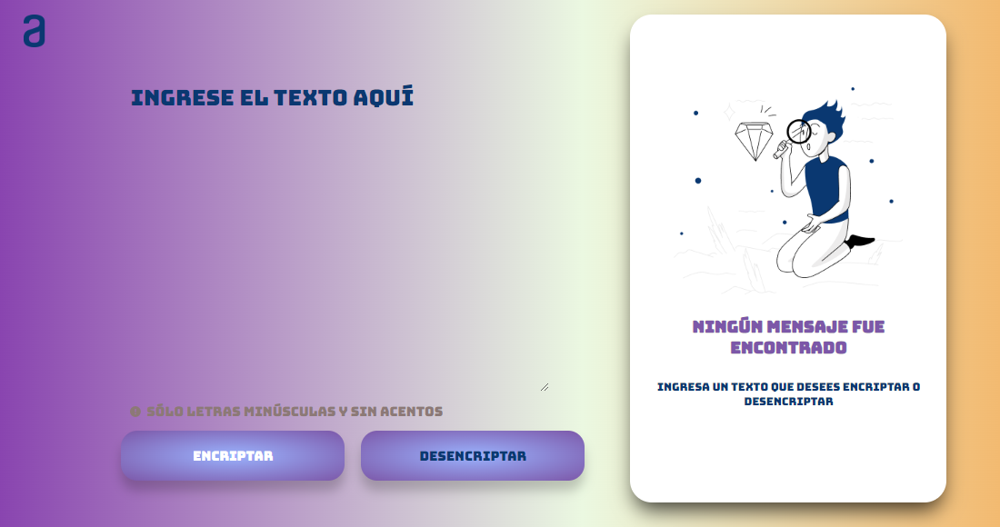

# Encriptador de Texto

Proyecto creado para el curso de Principiante lógica y programación de Alura.

## Descripción

Este proyecto es una aplicación web que permite encriptar y desencriptar textos utilizando un conjunto específico de reglas de transformación. Es una herramienta útil para aquellos que desean proteger su información de una manera sencilla y rápida.

## Características

- **Encriptar Texto**: Convierte las vocales en cadenas específicas según las reglas definidas.
- **Desencriptar Texto**: Revertir el texto encriptado a su forma original.
- **Copiar Texto**: Copia el resultado encriptado o desencriptado al portapapeles.
- **Interfaz Responsiva**: La aplicación se adapta a diferentes tamaños de pantalla para una mejor experiencia de usuario.

## Reglas de Encriptación

- La letra "e" se convierte en "enter"
- La letra "i" se convierte en "imes"
- La letra "a" se convierte en "ai"
- La letra "o" se convierte en "ober"
- La letra "u" se convierte en "ufat"

## Capturas de Pantalla

### Pantalla Principal

### Texto Encriptado

### Texto Desencriptado

## Link

Puedes acceder a la aplicación por el siguiente lonk:

https://julimartin.github.io/challenge_encriptador_de_texto/

## Uso

1. Ingresa el texto que deseas encriptar o desencriptar en el área de texto.
2. Haz clic en "Encriptar" o "Desencriptar" según sea el caso.
3. El resultado aparecerá en el área designada.
4. Puedes copiar el resultado haciendo clic en el botón "Copiar".

## Tecnologías Utilizadas

- HTML5
- CSS3
- JavaScript

## Autor

Desarrollado por Julieta Martin - 2024
